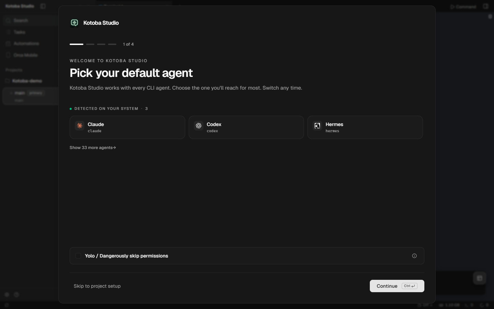
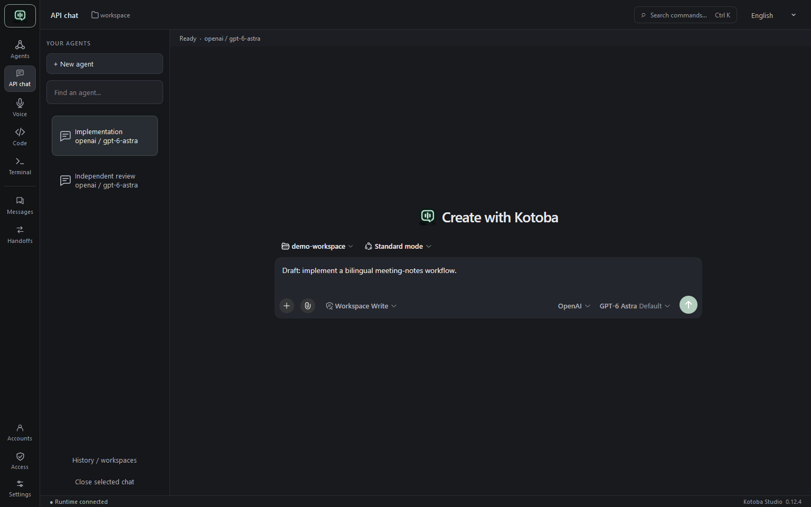
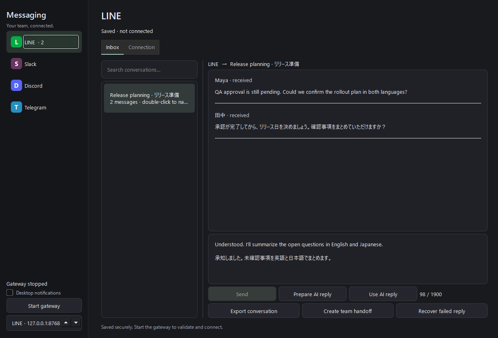
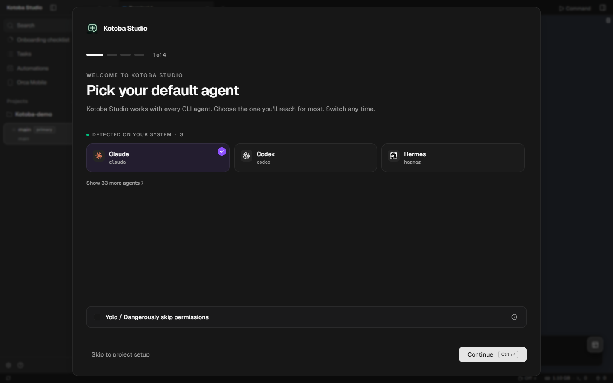
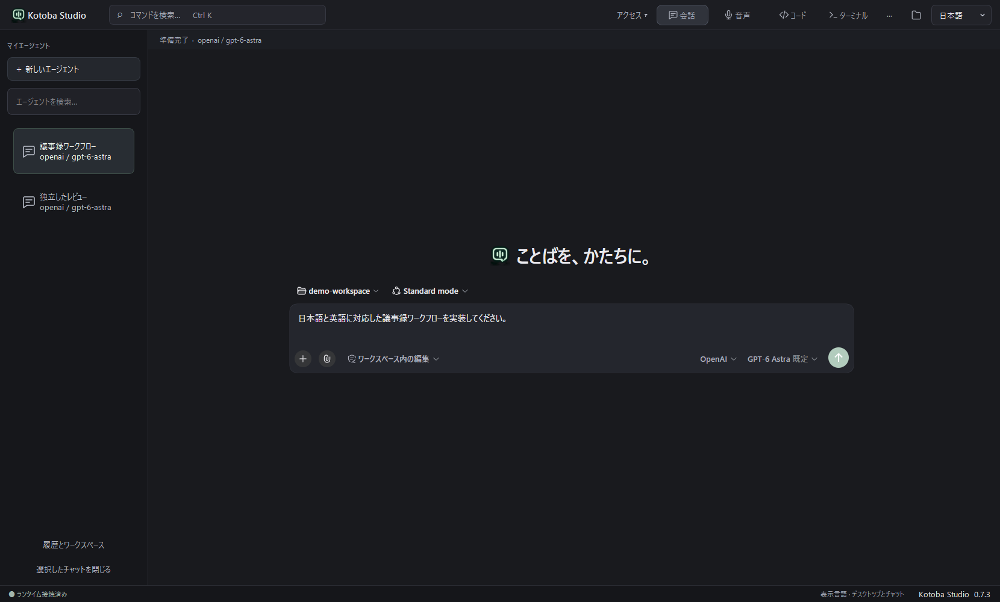
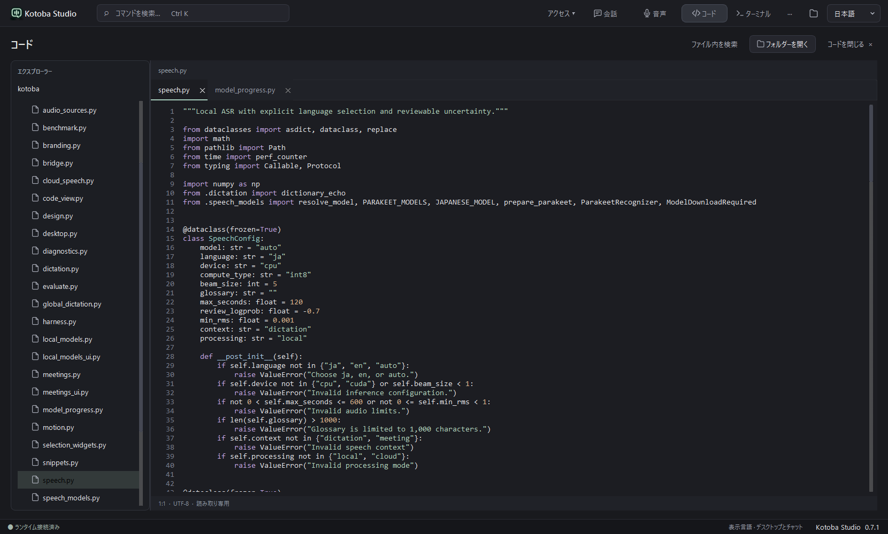
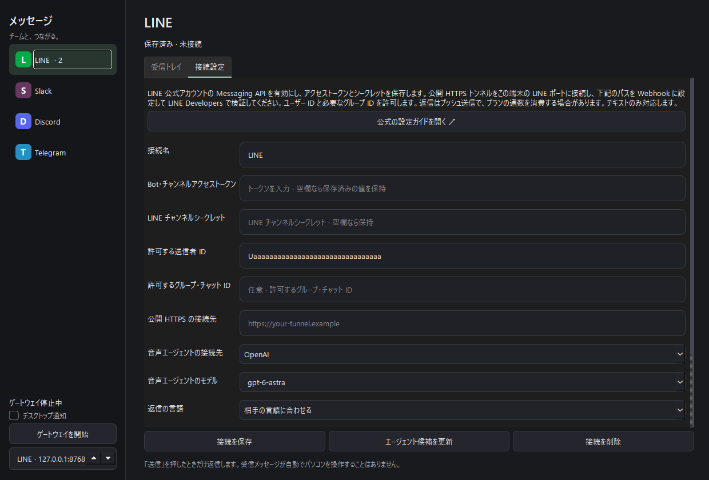

# Kotoba Studio · ことば

**Your coding agents. One place to build.**

Windows x64 · 0.10.1

[English](#english) · [日本語](#japanese)

A Windows desktop workspace for Japanese and English voice input, AI conversations, and development. Capture an idea from your microphone or an application, turn it into an editable instruction, and work with an agent using local models or cloud APIs.

[Get started](#run) · [Voice and local models](python/voice/README.md) · [Windows packaging](python/voice/WINDOWS.md) · [日本語](#japanese)

## Start with your coding-agent subscription

**Agents is the main workspace.** Run Codex, Claude Code, OpenCode or Pi through its installed CLI and sign-in. Use the subscriptions or credentials supported by that agent; one provider's subscription does not grant access to another. Open **Agent accounts** to manage supported connections.

Add a project, create a worktree for a task, and launch an agent. Concurrent tasks stay in the left sidebar, with one selected at a time. Terminals, changes, review and account switching use Orca's complete desktop implementation inside Kotoba's window. Split layouts remain optional. **API chat** is a secondary route to the full Harness and its configured providers.

The selected local worktree follows you into Code and Voice. Review dictated text before adding it to an empty native agent-chat draft; terminal-only agents can use paste-at-cursor dictation. Team handoffs and LINE-first messaging remain in the same application. Each external CLI manages its own permissions; **Access** opens the controls for the current workspace.

See [the subscription-agent workflow](python/voice/AGENTS_WORKFLOW.md) for setup, retained Orca workflows and validation limits. The screenshots below document the earlier API-chat and voice surfaces, which remain available.

The current embedded Agents onboarding detects locally installed CLIs. This screenshot does not establish account sign-in or model access; no agent instruction has been sent.

## One workspace, from voice to action

Speak a task, import a recording, or listen to an application. Kotoba transcribes locally and gives you the text to review before anything is sent to an agent. Keep names, numbers, and intent under your control, then bring the reviewed instruction into your chosen conversation.

The desktop combines persistent chat, a voice dock, a file explorer, a code viewer, and a PowerShell console. Model connections and plugins live alongside the work. You can hide a panel or change the interface language without losing a transcript or terminal output.

| Work with | What Kotoba provides |
| --- | --- |
| Japanese and English | Parakeet for English, Kotoba-Whisper for Japanese, selectable Whisper alternatives, and bilingual controls |
| Your audio sources | Microphone, system audio, application process capture, and imported recordings |
| Local AI | GGUF models through the bundled llama.cpp CPU engine; connections to Ollama and LM Studio |
| Cloud AI | Native OpenAI, Anthropic Claude, Kimi, and DeepSeek APIs; custom providers and per-conversation model selection |
| An agent workspace | Persistent sessions, file and terminal tools, skills, workflows, subagents, and Cordis plugins |
| Repeatable dictation | Global Windows hotkey, paste at cursor, saved phrases, undo, and reviewed agent drafts |
| Measurable results | Transcription latency, real-time factor, Japanese character error rate, and English word error rate against a supplied reference |

These screenshots show the running 0.7.3 app with **OpenAI → GPT-6 Astra** selected in chat and voice. The provider dropdown lists only configured providers; the adjacent model dropdown shows models for the selected provider. Chat and voice drafts are manually entered, unsent examples, not transcription results or generated responses.

### API chats, independent conversations

Use **+ New agent** or **Ctrl+T** to open another retained chat. Choose its provider and model in its own composer: OpenAI, Claude, Kimi, DeepSeek, and local routes can work in parallel. The left-hand chat list keeps one conversation visible at a time. Select a chat to make it the destination for reviewed voice input. Rows show the model, running activity, and background completion, with the full provider/model in the tooltip. Double-click a row to name the task. **Ctrl+Tab** and **Ctrl+Shift+Tab** switch chats. Closing a view leaves saved sessions and running agents on the host; confirm before discarding a view with an unsent draft. Separate browser storage preserves each open view's session selection across restarts. Agents sharing a workspace can edit the same files; use separate folders for conflicting work.

### Chat and voice, side by side

Review a voice draft alongside your agent workspace. This screenshot shows an example draft in the review field; it has not been sent to a provider.

### A clearer view of your code

Browse files, compare tabs, and search when you need it. Click **Code** again, use **Close Code**, or press **Esc** to return to chat without losing your open tabs.

## Start on Windows

The desktop build is **Kotoba Studio 0.10.1**, an unsigned developer preview for Windows x64. Install `Kotoba-Studio-0.10.1-Setup.exe` from your build output. The installer includes the subscription-agent workspace, full Harness runtime, audio capture helper, and CPU inference engine. Speech and language-model weights are separate. See the [Windows guide](python/voice/WINDOWS.md) to build and verify the installer.

1. **Open Agents.** Add a project, connect an installed coding agent in Agent accounts, and create a task in its own worktree.
2. **Optionally use API chat.** Open **··· → Routing** to configure an API provider, or choose Configure later and open Local models. Register a local model, then select Kotoba Local in the chat composer.
3. **Choose what to hear.** Open Voice Studio and select the audio source, speech language, and transcription model.
4. **Review, then act.** Record or import audio, correct the transcript, and use **Add to chat** to append it to the available conversation draft. Send when you are ready.

Voice Studio also offers a separate agent session through **Agent → Ask voice agent**. Its model selection is independent of the main chat composer. See the [desktop guide](python/voice/README.md) for both workflows.

| Shortcut | Action |
| --- | --- |
| `Ctrl+T` / `Ctrl+Tab` | New agent / switch chats |
| `Ctrl+K` | Search workspace commands |
| `Ctrl+Shift+V` | Show or hide Voice Studio |
| `Ctrl+J` | Show or hide the terminal |
| `Ctrl+Shift+E` | Show or hide Code |
| `Ctrl+F` | Search the selected source file |
| `Ctrl+W` | Close the active source tab |
| `Esc` | Close Code search, then return to chat |
| `Ctrl+Shift+Space` | Start or stop recording |

Close the window to keep Kotoba in the system tray; use its menu to reopen or quit. See [tray behavior and icons](python/voice/README.md#system-tray-and-windows-icons).

## Dictation and meeting notes

Enable **Desktop dictation** to speak into the focused application with **Ctrl+Shift+Space**. Open **Meetings & notes** to select a window, optionally include your microphone, save timestamped transcripts, highlight key points, and keep searchable development notes. Highlights retain source text; AI follow-ups start as a reviewed draft. See the [voice workflow guide](python/voice/VOICE.md) for models, capture boundaries, privacy, and limits.

## Messaging, with LINE first

Connect LINE, Slack, Discord, and Telegram from **··· → Messaging**. Keep a local inbox, name conversations, save drafts, review delivery status, and prepare replies with your selected voice agent. English/Japanese reply preferences and team handoffs connect messaging to the rest of your workspace. LINE needs your own public HTTPS webhook endpoint; messages and AI replies are sent explicitly. See [setup and platform limits](python/voice/WINDOWS.md#messaging-hub).

This native 0.9.0 preview uses fictional, manually entered messages and an unsent draft. The gateway is stopped; the image is not evidence of a live LINE account connection.

## English–Japanese team handoffs

Open **··· → Team handoffs** to keep original context, terminology, English/Japanese briefs, and reviewed decisions or action items together. Copy a meeting into a handoff, prepare an explicit request for your selected voice agent, and import its JSON reply for review. Share by copying or exporting bilingual Markdown. Handoffs stay on this device; translation uses a manual request/import step and there is no remote team synchronization. See the [handoff workflow](python/voice/WINDOWS.md#englishjapanese-team-handoffs).

## Choose where inference runs

Speech recognition defaults to local processing. Explicit cloud speech uploads are optional. A native GGUF model also runs on your computer; Ollama and LM Studio connections accept loopback endpoints only. A failed local connection does not silently fall back to a cloud provider or replay a turn. Agent tools can still access the network when used.

Cloud providers receive the text you submit to them. The agent runtime stores submitted text and session history locally; capture audio stays in memory. Saved phrases are stored locally as unencrypted text. Prepare speech weights explicitly in Audio settings before local transcription. See the [desktop guide](python/voice/README.md#local-language-models) for model lifecycle and connection details.

## Evaluate before relying on it

Model quality depends on the recording, selected model, hardware, and task. Use human-reviewed references to measure Japanese CER and English WER; agreement with automatic captions is not a ground-truth accuracy score. Small GGUF smoke tests establish integration, not dependable agent tool use.

Speaker diarization, streaming interruption, managed GPU inference, and automatic GGUF downloads are not implemented. Extensions without Japanese translations fall back to English. Review [SAFETY.md](SAFETY.md) before giving an agent workspace access.

## Build and contribute

Start with the [desktop development guide](python/voice/README.md#development). It covers the Python application, matching agent SDK, local speech evaluation, and native model behavior. The [Windows packaging guide](python/voice/WINDOWS.md) covers the installable executable.

For the underlying agent system, see [architecture](docs/architecture.md), [development](docs/development.md), and [contributing](CONTRIBUTING.md). The [integration inspection](python/voice/INSPECTION.md) explains how the upstream components fit together.

## Open-source foundations

The subscription-agent workspace reuses the pinned [Orca](https://github.com/stablyai/orca) desktop runtime, account management, worktrees and review interface under its MIT license. [Integration details](python/voice/AGENTS_WORKFLOW.md) describe the build overlay and external-service boundaries.

Kotoba Studio builds on the actual [DeepSeek Harness](https://github.com/deepseek-ai/deepseek-harness) runtime and plugin architecture. Audio capture and saved-phrase integration draw from [OpenWhispr](https://github.com/OpenWhispr/openwhispr); native local inference uses [llama.cpp](https://github.com/ggml-org/llama.cpp). Upstream identifiers remain where needed for compatibility, provider selection, and attribution.

[MIT license](LICENSE) · [Third-party notices](THIRD_PARTY_NOTICES.md) · [Bundled licenses](python/voice/THIRD_PARTY_LICENSES)

---

## 日本語 — 声から、開発へ。

### サブスクリプションのエージェントを、開発の中心に

起動後は **エージェント** がメイン画面になります。Codex、Claude Code、OpenCode、Pi を、それぞれの CLI とログインで利用できます。各エージェントが対応するサブスクリプションや認証情報が必要です。**エージェントのアカウント** から接続を設定してください。

プロジェクトを追加し、タスクごとに作業ツリーを作成してエージェントを起動します。並行するタスクは左の一覧にまとまり、一度にひとつを表示します。Orca の実際のデスクトップ実装を Kotoba 内に組み込み、ターミナル、変更差分、レビュー、アカウント切り替えを利用できます。分割表示は任意です。従来の Harness は **API チャット** から利用できます。

選択したローカルの作業ツリーはコード・音声画面と共有されます。音声は確認後、空のネイティブチャット下書きへ挿入します。ターミナル形式のエージェントではカーソル位置への貼り付けを利用してください。各 CLI の権限はそのエージェントが管理します。[設定と対応範囲](python/voice/AGENTS_WORKFLOW.md)をご覧ください。

この画面は、組み込まれたエージェント画面がローカルの CLI を検出した状態です。アカウント認証やモデルへのアクセスを確認した画像ではなく、指示も送信していません。

Kotoba Studio は、日本語と英語の音声入力、AI エージェント、開発作業を一つにまとめた Windows デスクトップアプリです。ローカルモデルやクラウド API を選び、複数のエージェントを独立したチャットで動かせます。音声で伝えた内容は、送信前に確認・編集できます。

### 複数のエージェントを、左の一覧で管理

左側の一覧から、作業したいチャットを選びます。チャットごとに下書きとモデルを管理し、別のエージェントはバックグラウンドで実行を続けられます。実行中・完了の状態も一覧で確認できます。

**＋ 新しいエージェント** または **Ctrl+T** でチャットを追加し、ワークスペースとモデルを選択してください。検索、名前のダブルクリックによる変更、**Ctrl+Tab** での切り替えに対応しています。**履歴とワークスペース** から保存済みの会話を開き、**エージェントに戻る** で一覧に戻れます。同じファイルへの編集が競合しそうな場合は、作業フォルダーを分けてください。

### 音声を確認して、次のアクションへ

**音声** を開き、マイク、システム音声、アプリの音声、または音声ファイルを選びます。ローカルで文字起こしを行う前に、**音声設定 → モデルを準備** でモデルをダウンロードしてください。英語は NVIDIA Parakeet、日本語は Kotoba-Whisper が初期設定です。ほかの Whisper モデルも選べます。

名前・数字・意図を確認して修正し、**チャットに追加** で選択中の会話の下書きに入れます。内容を確認してから送信してください。デスクトップ音声入力を有効にすると、**Ctrl+Shift+Space** でカーソル位置に入力できます。会議とノートの機能では、時刻付きの文字起こし、重要箇所、検索できるメモを残せます。詳しくは[音声ワークフロー](python/voice/VOICE.md)をご覧ください。

### コードとツールを、同じアプリで

ファイル一覧、ソースコードのタブ、検索、PowerShell ターミナルを利用できます。**コード** を再度クリックするか、**コードを閉じる** または **Esc** で会話に戻れます。Harness のツール、権限、スキル、ワークフロー、サブエージェント、Cordis プラグインも利用できます。

画像は 0.7.3 の実際のアプリ画面です。会話と音声エージェントには **OpenAI → GPT-6 Astra** を選択しています。プロバイダーの一覧には設定済みの接続先のみを表示し、隣のモデル一覧からその接続先のモデルを選べます。チャットと音声欄の文章は手入力した未送信の例であり、文字起こし結果や AI の生成結果ではありません。

### LINE を先頭に、メッセージをまとめる

**··· → メッセージ** から LINE、Slack、Discord、Telegram を設定できます。受信トレイ・会話名・下書き・送信状態を端末に保存し、英語と日本語の返信を音声エージェントに依頼できます。LINE には利用者側の公開 HTTPS Webhook が必要です。受信では自動実行せず、返信は確認して送信します。[設定と制約](python/voice/WINDOWS.md#messaging-hub)をご確認ください。

この画面は 0.9.0 の手動設定例です。認証情報はテスト用で、ゲートウェイは停止中です。実際の LINE 接続を示す画像ではありません。

### 英語と日本語のチームで引き継ぐ

**··· → チームの引き継ぎ** で、原文・用語・両言語の要約・決定事項・担当者をまとめられます。会議からコピーし、選択した音声エージェントへの依頼を確認して送信した後、JSON の応答を未確認の下書きとして取り込みます。共有はコピーまたは Markdown の書き出しで行います。データはこの端末に保存され、自動翻訳や遠隔同期はありません。

### Windows で始める

現在のデスクトップ版は **0.10.1**、Windows x64 向けの未署名の開発者プレビューです。[Windows パッケージ作成ガイド](python/voice/WINDOWS.md)に従って `Kotoba-Studio-0.10.1-Setup.exe` を作成できます。インストーラーには、サブスクリプションのエージェント用ワークスペース、Harness 実行環境、音声キャプチャー、CPU 推論エンジンが含まれます。モデルの重みは別途ダウンロードするか、手元のファイルを登録してください。

1. **作業フォルダーを選ぶ。** エージェントが作業するフォルダーを指定します。
2. **モデルを接続する。** **··· → 接続** で OpenAI、Anthropic Claude、Kimi、DeepSeek、またはカスタムの接続先を設定します。ローカルで使う場合は **ローカル AI** で GGUF モデルを登録してエンジンを起動し、会話の入力欄で **Kotoba Local** を選びます。Ollama と LM Studio にも接続できます。
3. **会話または音声入力を始める。** チャットごとにモデルを選びます。ローカル録音の前に音声モデルを準備し、文字起こしを確認してから送信してください。

| ショートカット | 操作 |
| --- | --- |
| `Ctrl+T` / `Ctrl+Tab` | エージェントを追加 / チャットを切り替え |
| `Ctrl+K` | コマンドを検索 |
| `Ctrl+Shift+V` | 音声スタジオを表示・非表示 |
| `Ctrl+Shift+E` / `Ctrl+J` | コード / ターミナルを表示・非表示 |
| `Ctrl+F` / `Ctrl+W` | コード内を検索 / ソースのタブを閉じる |
| `Ctrl+Shift+Space` | 録音を開始・停止 |

ウィンドウを閉じると、Kotoba はシステムトレイで動作を続けます。トレイのメニューから再表示・終了できます。更新をインストールする前に終了してください。アプリの再起動後は、ローカルエンジンを起動し直す必要があります。右上の **English / 日本語** は表示言語の切り替えです。会話本文やコードは翻訳しません。

### ローカル処理と、利用上の制約

音声処理はローカルモードで起動します。クラウドでの文字起こしは明示的に選ぶ設定で、クラウドのプロバイダーには送信した内容が渡ります。GGUF モデルは同梱の llama.cpp CPU エンジンで実行し、Ollama と LM Studio はループバック接続に対応します。ローカル処理の失敗時に、クラウドへ自動で切り替えることはありません。エージェントのツールは権限に応じてネットワークを利用できます。

ノート、文字起こし、保存したフレーズ、会話履歴はローカルに暗号化せず保存されます。精度は音声、ハードウェア、タスクによって変わります。日本語の CER・英語の WER は、人が確認した参照文で評価してください。自動字幕を正解として扱わないでください。話者分離、ストリーミング中の割り込み、アプリが管理する GPU 推論、GGUF の自動ダウンロードは未実装です。日本語訳がない拡張機能は英語で表示されます。[デスクトップガイド](python/voice/README.md)と[アクセス権限の説明](SAFETY.md)も参照してください。

### 開発・拡張・貢献

[デスクトップ開発](python/voice/README.md#development)、[アーキテクチャ](docs/architecture.md)、[貢献ガイド](CONTRIBUTING.md)から始められます。Kotoba は [DeepSeek Harness](https://github.com/deepseek-ai/deepseek-harness) の実際の実行環境とプラグイン機構を基盤とし、[OpenWhispr](https://github.com/OpenWhispr/openwhispr) の音声キャプチャー・音声入力の実装を取り入れています。ローカル推論には [llama.cpp](https://github.com/ggml-org/llama.cpp) を使用しています。詳しくは[統合内容の調査](python/voice/INSPECTION.md)をご覧ください。

[MIT ライセンス](LICENSE) · [第三者ライセンス表記](THIRD_PARTY_NOTICES.md) · [同梱ライセンス](python/voice/THIRD_PARTY_LICENSES)
