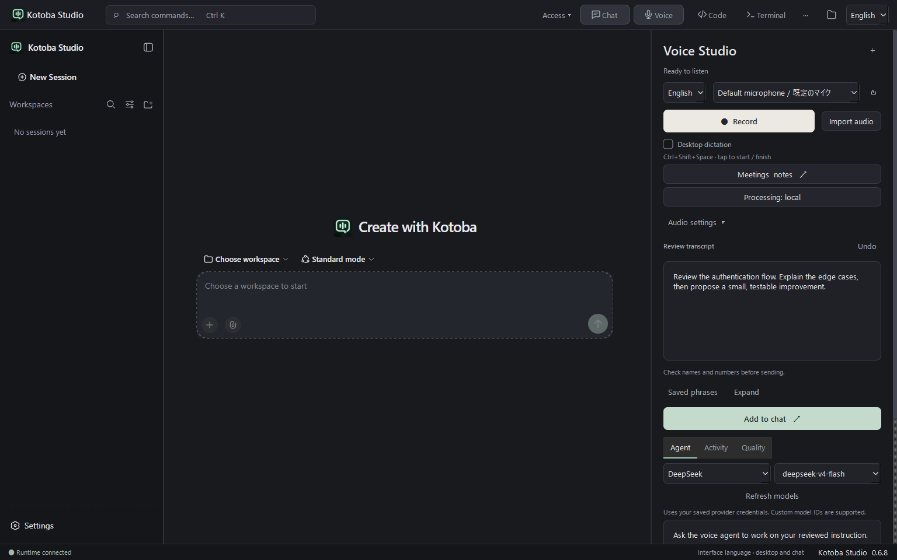
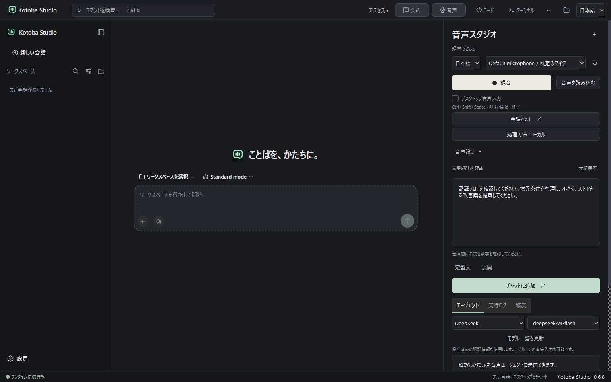

# Kotoba Studio · ことば

**Speak naturally. Review clearly. Build with AI.**

English |　日本語

A Windows desktop workspace for Japanese and English voice input, AI conversations, and development. Capture an idea from your microphone or an application, turn it into an editable instruction, and work with an agent using local models or cloud APIs.

[Get started](#run) · [Voice and local models](python/voice/README.md) · [Windows packaging](python/voice/WINDOWS.md) · [日本語](#japanese)

## One workspace, from voice to action

Speak a task, import a recording, or listen to an application. Kotoba transcribes locally and gives you the text to review before anything is sent to an agent. Keep names, numbers, and intent under your control, then bring the reviewed instruction into your chosen conversation.

The desktop combines persistent chat, a voice dock, a file explorer, a code viewer, and a PowerShell console. Model connections and plugins live alongside the work. You can hide a panel or change the interface language without losing a transcript or terminal output.

| Work with | What Kotoba provides |
| --- | --- |
| Japanese and English | Parakeet for English, Kotoba-Whisper for Japanese, selectable Whisper alternatives, and bilingual controls |
| Your audio sources | Microphone, system audio, application process capture, and imported recordings |
| Local AI | GGUF models through the bundled llama.cpp CPU engine; connections to Ollama and LM Studio |
| Cloud AI | Native OpenAI, Anthropic Claude, Kimi, and DeepSeek APIs; custom providers and per-conversation model selection |
| An agent workspace | Persistent sessions, file and terminal tools, skills, workflows, subagents, and Cordis plugins |
| Repeatable dictation | Global Windows hotkey, paste at cursor, saved phrases, undo, and reviewed agent drafts |
| Measurable results | Transcription latency, real-time factor, Japanese character error rate, and English word error rate against a supplied reference |

### Chat and voice, side by side

Review a voice draft alongside your agent workspace. This screenshot shows an example draft in the review field; it has not been sent to a provider.

### A clearer view of your code

Browse files, compare tabs, and search when you need it. Click **Code** again, use **Close Code**, or press **Esc** to return to chat without losing your open tabs.

## Start on Windows

The desktop build is **Kotoba Studio 0.6.8**, an unsigned developer preview for Windows x64. Install `Kotoba-Studio-0.6.8-Setup.exe` from your build output. The installer includes the desktop application, agent runtime, audio capture helper, and CPU inference engine. Speech and language-model weights are separate. See the [Windows guide](python/voice/WINDOWS.md) to build and verify the installer.

1. **Choose a folder.** Give the agent a working directory for the task.
2. **Connect a model.** Open **··· → Routing** to configure an API provider, or choose Configure later and open Local models. Register a local model, then select Kotoba Local in the chat composer.
3. **Choose what to hear.** Open Voice Studio and select the audio source, speech language, and transcription model.
4. **Review, then act.** Record or import audio, correct the transcript, and use **Add to chat** to append it to the available conversation draft. Send when you are ready.

Voice Studio also offers a separate agent session through **Agent → Ask voice agent**. Its model selection is independent of the main chat composer. See the [desktop guide](python/voice/README.md) for both workflows.

| Shortcut | Action |
| --- | --- |
| `Ctrl+K` | Search workspace commands |
| `Ctrl+Shift+V` | Show or hide Voice Studio |
| `Ctrl+J` | Show or hide the terminal |
| `Ctrl+Shift+E` | Show or hide Code |
| `Ctrl+F` | Search the selected source file |
| `Ctrl+W` | Close the active source tab |
| `Esc` | Close Code search, then return to chat |
| `Ctrl+Shift+Space` | Start or stop recording |

Close the window to keep Kotoba in the system tray; use its menu to reopen or quit. See [tray behavior and icons](python/voice/README.md#system-tray-and-windows-icons).

## 日本語で使う

Kotoba Studio は、日本語・英語の音声入力から AI との作業へつなぐ Windows アプリです。右上の **English / 日本語** で、デスクトップと主要なチャット操作の表示言語を切り替えられます。会話本文やコードは翻訳しません。

音声スタジオで録音元と言語を選び、録音または音声ファイルの読み込みを行います。文字起こしの名前・数字・意図を確認し、必要に応じて修正してください。**チャットに追加** で会話の下書きに追加します。入力欄が未準備の場合はコピーします。確認してから送信してください。

**ローカルモデル** では GGUF ファイルを同梱の CPU エンジンで実行できます。Ollama / LM Studio への接続も可能です。モデルの重みは別途必要です。登録後、チャットのモデル選択で **Kotoba Local** を選びます。再起動後はローカルエンジンを起動し直してください。

上の画像は、送信前に確認するための入力例です。

## Dictation and meeting notes

Enable **Desktop dictation** to speak into the focused application with **Ctrl+Shift+Space**. Open **Meetings & notes** to select a window, optionally include your microphone, save timestamped transcripts, highlight key points, and keep searchable development notes. Highlights retain source text; AI follow-ups start as a reviewed draft. See the [voice workflow guide](python/voice/VOICE.md) for models, capture boundaries, privacy, and limits.

## Choose where inference runs

Speech recognition defaults to local processing. Explicit cloud speech uploads are optional. A native GGUF model also runs on your computer; Ollama and LM Studio connections accept loopback endpoints only. A failed local connection does not silently fall back to a cloud provider or replay a turn. Agent tools can still access the network when used.

Cloud providers receive the text you submit to them. The agent runtime stores submitted text and session history locally; capture audio stays in memory. Saved phrases are stored locally as unencrypted text. Prepare speech weights explicitly in Audio settings before local transcription. See the [desktop guide](python/voice/README.md#local-language-models) for model lifecycle and connection details.

## Evaluate before relying on it

Model quality depends on the recording, selected model, hardware, and task. Use human-reviewed references to measure Japanese CER and English WER; agreement with automatic captions is not a ground-truth accuracy score. Small GGUF smoke tests establish integration, not dependable agent tool use.

Speaker diarization, streaming interruption, managed GPU inference, and automatic GGUF downloads are not implemented. Extensions without Japanese translations fall back to English. Review [SAFETY.md](SAFETY.md) before giving an agent workspace access.

## Build and contribute

Start with the [desktop development guide](python/voice/README.md#development). It covers the Python application, matching agent SDK, local speech evaluation, and native model behavior. The [Windows packaging guide](python/voice/WINDOWS.md) covers the installable executable.

For the underlying agent system, see [architecture](docs/architecture.md), [development](docs/development.md), and [contributing](CONTRIBUTING.md). The [integration inspection](python/voice/INSPECTION.md) explains how the upstream components fit together.

## Open-source foundations

Kotoba Studio builds on the actual [DeepSeek Harness](https://github.com/deepseek-ai/deepseek-harness) runtime and plugin architecture. Audio capture and saved-phrase integration draw from [OpenWhispr](https://github.com/OpenWhispr/openwhispr); native local inference uses [llama.cpp](https://github.com/ggml-org/llama.cpp). Upstream identifiers remain where needed for compatibility, provider selection, and attribution.

[MIT license](LICENSE) · [Third-party notices](THIRD_PARTY_NOTICES.md) · [Bundled licenses](python/voice/THIRD_PARTY_LICENSES)
